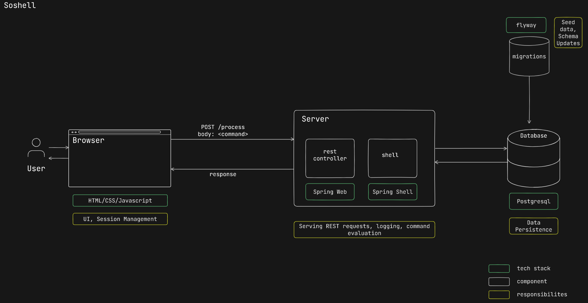

# ⌨️ Project Soshell
A Terminal Inspired Social Media Platform for Advanced Users.

## Architecture

## Demo


## Tech Stack
- Front-End - HTML/CSS/Javascript
- Back-end - Spring Boot
- Database - Postgresql
  
## Features
### User Authentication and Authorization
 - Allow users to create accounts, log in, and log out.
 - Secure password storage and authentication.

```
user signup --username <username> --password <password>
user login --username <username> --password <password>
user view <username>
user logout
user delete <username>
```

### Posting and Sharing
 - Allows users to create text-based posts.
 - Ability to view and rate(1-10) posts.

```
post create <post-content>
post delete <post-id>
post rate <post-id> <rating-point> # rating point between 1-10
post view <post-id>
```
### User feed
 - Show posts created by users
 - Ability to view posts in paginated manner

```
post list -u <username> # returns list of user created posts
post list # returns top 5 unread posts and mark them as 'read'
post list --limit <int(1-5), min=1 default,max=5> --page <int(1-n), min=1 default=1># get feed in paginated way
```

## NFRs
 - Logging using logback
 - Database migrations using flyway
 - Object Relational Mapping using Spring Data JPA 
 - Validations using jakarta validations API
 - Unit testing using Junit,Mockito

## Pre-requisites

  - docker

## Running locally

To run locally, you must first clone the repository. 
```bash
git clone https://github.com/avinash-550/project-soshell.git
```

Once cloned go to the docker folder and run the docker command. This will start all the dependencies along with the application. 
```bash
cd project-soshell/docker
docker compose up
```

Now visit http://locahost:3000/ to access the application.


> [!TIP]
> You can create an `.env` file in the project's root to configure your environment.

> [!TIP]
> You can use docker-compose-dependencies.yaml file to only bring up the dependencies.

## Future Scope
### Followers and Following
 - Allow users to follow and unfollow other users.
 - Display a list of followers and following. 

```
user follow <username>
user unfollow <username>
user following # returns top 5 users user is following
user following --limit <int(1-5), min=1 default,max=5> --page <int(1-n), min=1 default=1> # get following in paginated way
user followers # retunrs top 5 users following user
user followers --limit <int(1-5), min=1 default,max=5> --page <int(1-n), min=1 default=1> # get followers in paginated way
```


### Search Functionality
 - Search an user or post by given keyword.

```
search users abc # searches user(s) with username containing abc
search posts abc # searches posts(s) containing xyz under all users
search posts --user-id abc xyz # searches for post(s) containing xyz under user abc
search <entity(users/posts), default=posts> --user-id <user-id> --limit <int(1-5), min=1 default,max=5> --page <int(1-n), min=1 default=1> <anyKeyword(string), default="" minlen=0 maxlen=10> # full search command
```

## References
* [Official Apache Maven documentation](https://maven.apache.org/guides/index.html)
* [Spring Boot Maven Plugin Reference Guide](https://docs.spring.io/spring-boot/docs/3.2.1/maven-plugin/reference/html/)
* [Spring Boot DevTools](https://docs.spring.io/spring-boot/docs/3.2.1/reference/htmlsingle/index.html#using.devtools)
* [Validation](https://docs.spring.io/spring-boot/docs/3.2.1/reference/htmlsingle/index.html#io.validation)
* [Spring Data JPA](https://spring.io/projects/spring-data-jpa/)
* [Spring Web](https://docs.spring.io/spring-boot/docs/3.2.1/reference/htmlsingle/index.html#web)
* [Spring Shell](https://spring.io/projects/spring-shell)
* [Building a RESTful Web Service](https://spring.io/guides/gs/rest-service/)
* [Serving Web Content with Spring MVC](https://spring.io/guides/gs/serving-web-content/)
* [Building REST services with Spring](https://spring.io/guides/tutorials/rest/)
